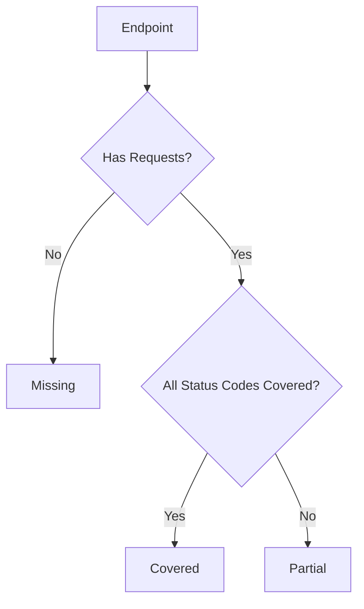
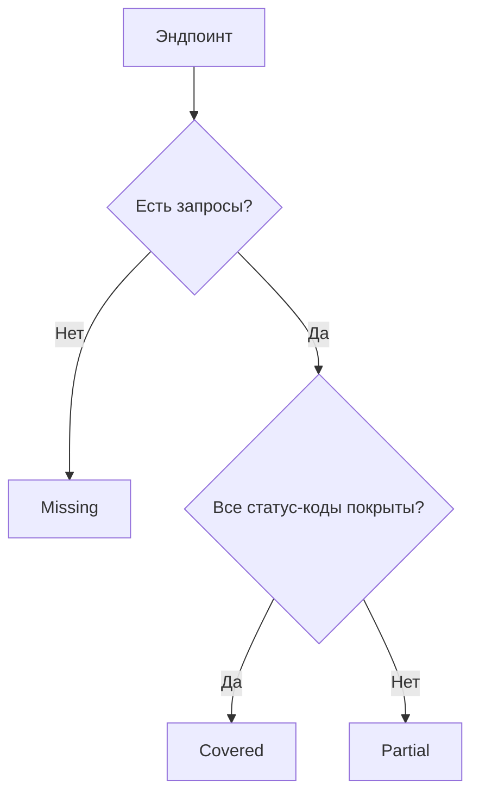

# API Coverage Library Architecture

[Russian version (Русская версия)](#архитектура-библиотеки-api-coverage)

## Overview

The API Coverage Library is designed to track and analyze API test coverage based on Swagger/OpenAPI specifications. It provides real-time monitoring of API requests and generates comprehensive coverage reports.

## Core Components

### 1. ApiCoverage Class

Main orchestrator class that:
- Initializes the coverage tracking system
- Manages the lifecycle of coverage tracking
- Coordinates between other components
- Provides the main public API

```javascript
class ApiCoverage {
    constructor(options)
    async start()
    async stop()
    recordRequest(request)
    async generateReport()
}
```

### 2. RequestCollector

Responsible for:
- Intercepting API requests
- Collecting request and response data
- Normalizing request data
- Matching requests with Swagger endpoints

```javascript
class RequestCollector {
    constructor(apiCoverage, options)
    async start()
    async stop()
    collect(request)
}
```

### 3. ReportGenerator

Handles:
- Generation of HTML reports
- Generation of JSON reports
- Report templating
- Asset management

```javascript
class ReportGenerator {
    constructor(options)
    async generateHtmlReport(coverage)
    async generateJsonReport(coverage)
}
```

### 4. Coverage Calculator

Performs:
- Coverage calculations
- Status code analysis
- Endpoint grouping
- Statistics generation

## Data Flow

1. **Initialization**:
   ```
   SwaggerSpec → ApiCoverage → RequestCollector
   ```

2. **Request Processing**:
   ```
   API Request → RequestCollector → Coverage Calculator → Coverage Data
   ```

3. **Report Generation**:
   ```
   Coverage Data → ReportGenerator → HTML/JSON Reports
   ```

## Coverage States



## File Structure

```
src/
├── coverage/
│   ├── ApiCoverage.js       # Main class
│   ├── RequestCollector.js  # Request tracking
│   ├── ReportGenerator.js   # Report generation
│   ├── utils/
│   │   └── coverageUtils.js # Helper functions
│   └── templates/
│       ├── coverage.html    # HTML report template
│       └── assets/          # Report assets
tests/
└── integration/
    └── playwright/          # Integration tests
```

---

# Архитектура библиотеки API Coverage

## Обзор

Библиотека API Coverage предназначена для отслеживания и анализа покрытия API-тестами на основе спецификаций Swagger/OpenAPI. Она обеспечивает мониторинг API-запросов в реальном времени и генерирует подробные отчеты о покрытии.

## Основные компоненты

### 1. Класс ApiCoverage

Основной класс-оркестратор, который:
- Инициализирует систему отслеживания покрытия
- Управляет жизненным циклом отслеживания
- Координирует работу других компонентов
- Предоставляет основной публичный API

```javascript
class ApiCoverage {
    constructor(options)
    async start()
    async stop()
    recordRequest(request)
    async generateReport()
}
```

### 2. RequestCollector

Отвечает за:
- Перехват API-запросов
- Сбор данных запросов и ответов
- Нормализацию данных запросов
- Сопоставление запросов с эндпоинтами Swagger

```javascript
class RequestCollector {
    constructor(apiCoverage, options)
    async start()
    async stop()
    collect(request)
}
```

### 3. ReportGenerator

Обрабатывает:
- Генерацию HTML-отчетов
- Генерацию JSON-отчетов
- Шаблонизацию отчетов
- Управление ресурсами

```javascript
class ReportGenerator {
    constructor(options)
    async generateHtmlReport(coverage)
    async generateJsonReport(coverage)
}
```

### 4. Coverage Calculator

Выполняет:
- Расчеты покрытия
- Анализ статус-кодов
- Группировку эндпоинтов
- Генерацию статистики

## Поток данных

1. **Инициализация**:
   ```
   SwaggerSpec → ApiCoverage → RequestCollector
   ```

2. **Обработка запросов**:
   ```
   API Request → RequestCollector → Coverage Calculator → Coverage Data
   ```

3. **Генерация отчетов**:
   ```
   Coverage Data → ReportGenerator → HTML/JSON Reports
   ```

## Состояния покрытия



## Структура файлов

```
src/
├── coverage/
│   ├── ApiCoverage.js       # Основной класс
│   ├── RequestCollector.js  # Отслеживание запросов
│   ├── ReportGenerator.js   # Генерация отчетов
│   ├── utils/
│   │   └── coverageUtils.js # Вспомогательные функции
│   └── templates/
│       ├── coverage.html    # Шаблон HTML-отчета
│       └── assets/          # Ресурсы отчета
tests/
└── integration/
    └── playwright/          # Интеграционные тесты
``` 