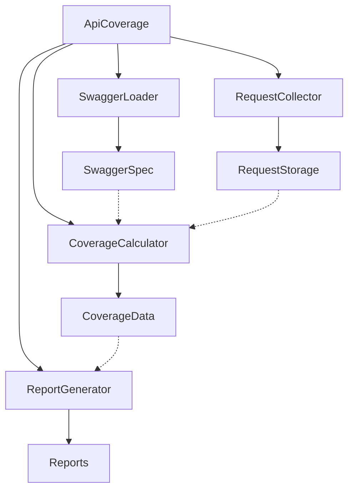

# API Coverage Architecture

## Overview

The API Coverage tool is designed to track and report API test coverage based on Swagger specifications. It follows a modular architecture that separates concerns and makes the system more maintainable and testable.

## Architecture Diagram

## Components

### 1. ApiCoverage (Facade)
The main entry point that orchestrates the entire process. It provides a simple interface for:
- Initializing the coverage tracking with Swagger specification
- Setting up request collection
- Starting and stopping coverage tracking
- Generating coverage reports

### 2. SwaggerLoader
Responsible for:
- Loading Swagger specifications from file
- Parsing and validating the specification
- Extracting basePath if not provided
- Providing access to API endpoint definitions

### 3. RequestCollector
Handles:
- Collecting API requests from Playwright
- Extracting paths from URLs by removing baseUrl
- Transforming requests into a standardized format
- Storing requests for coverage calculation

### 4. CoverageCalculator
Calculates:
- Total number of endpoints
- Covered endpoints
- Partially covered endpoints
- Coverage percentage
- Groups endpoints by services

### 5. ReportGenerator
Generates:
- HTML reports with coverage statistics
- JSON reports with detailed coverage data
- Visual representations of coverage

## Data Flow

1. Swagger specification is loaded and parsed
2. RequestCollector is initialized with baseUrl and basePath
3. API requests are automatically collected during test execution
4. Coverage is calculated based on recorded requests and Swagger spec
5. Reports are generated when coverage tracking is stopped

## Benefits

- **Modularity**: Each component can be replaced or modified independently
- **Testability**: Components can be tested in isolation
- **Flexibility**: Easy to add new features or change existing ones
- **Maintainability**: Clear separation of concerns makes code easier to understand and maintain
- **Integration**: Seamless integration with Playwright test framework
- **Automatic Collection**: No need to manually record requests
- **Configurable**: Easy to configure through options 