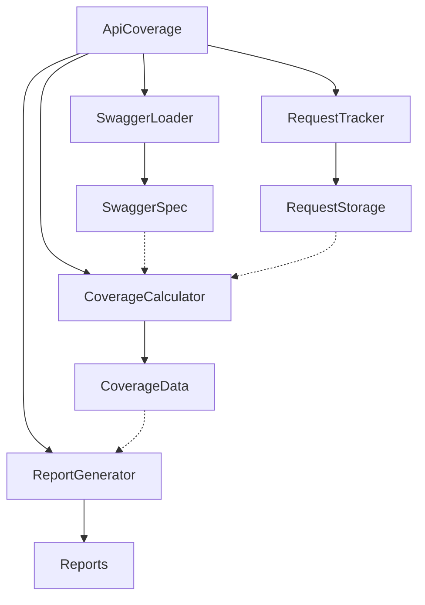

# API Coverage Architecture

## Overview

The API Coverage tool is designed to track and report API test coverage based on Swagger specifications. It follows a modular architecture that separates concerns and makes the system more maintainable and testable.

## Architecture Diagram

## Components

### 1. ApiCoverage (Facade)
The main entry point that orchestrates the entire process. It provides a simple interface for:
- Initializing the coverage tracking
- Recording API requests
- Generating coverage reports

### 2. SwaggerLoader
Responsible for:
- Loading Swagger specifications from various sources (URL, file)
- Parsing and validating the specification
- Providing access to API endpoint definitions

### 3. RequestTracker
Handles:
- Recording API requests with their details
- Storing request history
- Providing access to recorded requests

### 4. CoverageCalculator
Calculates:
- Total number of endpoints
- Covered endpoints
- Partially covered endpoints
- Coverage percentage
- Groups endpoints by services

### 5. ReportGenerator
Generates:
- HTML reports with coverage statistics
- JSON reports with detailed coverage data
- Visual representations of coverage

## Data Flow

1. Swagger specification is loaded and parsed
2. API requests are recorded during test execution
3. Coverage is calculated based on recorded requests and Swagger spec
4. Reports are generated from coverage data

## Benefits

- **Modularity**: Each component can be replaced or modified independently
- **Testability**: Components can be tested in isolation
- **Flexibility**: Easy to add new features or change existing ones
- **Maintainability**: Clear separation of concerns makes code easier to understand and maintain 