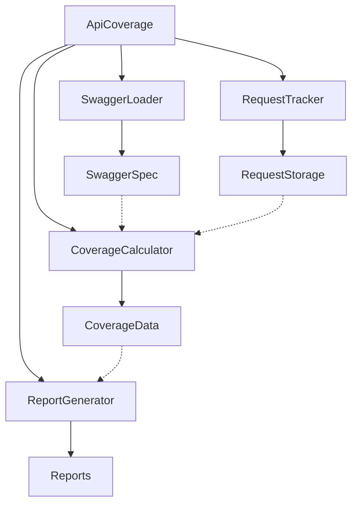

# Архитектура API Coverage

## Обзор

Инструмент API Coverage разработан для отслеживания и отчетности о покрытии тестами API на основе спецификаций Swagger. Он следует модульной архитектуре, которая разделяет ответственность и делает систему более поддерживаемой и тестируемой.

## Диаграмма архитектуры

## Компоненты

### 1. ApiCoverage (Фасад)
Основная точка входа, которая управляет всем процессом. Предоставляет простой интерфейс для:
- Инициализации отслеживания покрытия
- Записи запросов API
- Генерации отчетов о покрытии

### 2. SwaggerLoader
Отвечает за:
- Загрузку спецификаций Swagger из различных источников (URL, файл)
- Парсинг и валидацию спецификации
- Предоставление доступа к определениям эндпоинтов API

### 3. RequestTracker
Обрабатывает:
- Запись запросов API с их деталями
- Хранение истории запросов
- Предоставление доступа к записанным запросам

### 4. CoverageCalculator
Рассчитывает:
- Общее количество эндпоинтов
- Покрытые эндпоинты
- Частично покрытые эндпоинты
- Процент покрытия
- Группировку эндпоинтов по сервисам

### 5. ReportGenerator
Генерирует:
- HTML-отчеты со статистикой покрытия
- JSON-отчеты с детальными данными о покрытии
- Визуальные представления покрытия

## Поток данных

1. Спецификация Swagger загружается и парсится
2. Запросы API записываются во время выполнения тестов
3. Покрытие рассчитывается на основе записанных запросов и спецификации Swagger
4. Отчеты генерируются из данных о покрытии

## Преимущества

- **Модульность**: Каждый компонент может быть заменен или модифицирован независимо
- **Тестируемость**: Компоненты могут быть протестированы изолированно
- **Гибкость**: Легко добавлять новые функции или изменять существующие
- **Поддерживаемость**: Четкое разделение ответственности делает код более понятным и легким в поддержке 